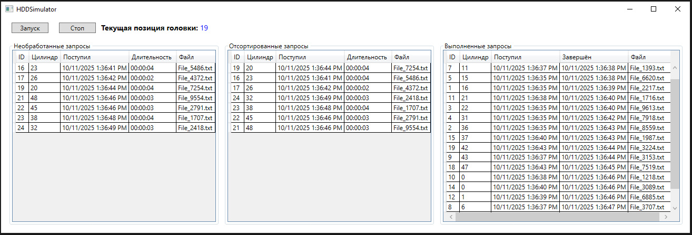

# HDD-Simulator

Симулятор работы жесткого диска с визуализацией алгоритмов планирования запросов.

## Описание

Программа моделирует процесс обработки запросов к жесткому диску, 
позволяя наблюдать движение головки и работу алгоритмов планирования - механизма управления компьютером своими ресурсами.  
Используемый алгоритм сортировки: C-SCAN (Circular SCAN), в котором головка диска движения в одном направлении, 
при достижении последнего цилиндра перемещается на нулевой цилиндр, и процесс поиска продолжается.
Проект реализован по паттерну **MVVM** с использованием **WPF**.

## Основные функции

- Настройка параметров диска (количество цилиндров, время перемещения, вероятность новых запросов);
- Визуализация движения головки;
- Пошаговое моделирование программы;
- Возможность остановки и сброса симуляции.

## Принцип работы

1. При запуске пользователь задаёт параметры симуляции через окно **Настройки диска**.
2. Программа создаёт очередь запросов к цилиндрам диска.
3. Головка перемещается между цилиндрами согласно алгоритму C-SCAN.
4. Визуализация обновляется в реальном времени.



## Запуск проекта

1. Склонировать репозиторий:
   ```bash
   git clone https://github.com/vadimHey/HDD-Simulator.git
   ```
2. Открыть решение HDDSimulator.sln в Visual Studio.
3. Запустить проект без отладки (Ctrl + F5).